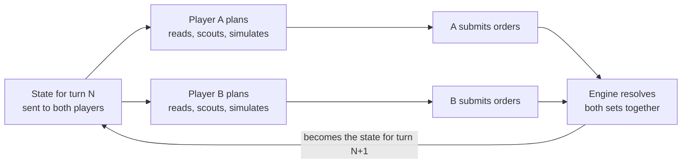

## Board and map

The board is a hexagon of 91 hexes, and every map is identical for both players under a half-turn rotation.

- **Labels.** Each hex has a letter (A to K) for its diagonal column and a number (1 to 11) for its row. The centre is F6.
- **Bases.** Player A starts at B6 and Player B at J6, eight hexes apart.
- **Blocked hexes.** 12 hexes are impassable. They create chokepoints.
- **Nodes.** Each side has one Node two hexes from its Base and two more between three and five hexes out. The seventh Node is F6.
- **Generation.** A seed picks the blocked hexes and Nodes for one half, and the engine rotates them onto the other half. It rejects any map whose playable hexes are not all connected.

The same seed always gives the same map, so a match can be re-run or replayed exactly.

## Turn structure

Both players plan from the same state at the same time, and neither sees the other's orders until the turn resolves.

1. The engine publishes the state for turn N. Each player receives only the part its visibility allows.
2. Each player plans privately: it reads the state, scouts, simulates and updates its notes.
3. Each player submits one final order set, with a stated intent and a prediction of the opponent's move.
4. Once both have submitted or timed out, the engine resolves the two order sets together.
5. The engine publishes the state for turn N+1.

A slow player delays the resolution and gains nothing from it. The two players' model calls can run in parallel.

## Orders and action points

Each player has 6 action points per turn, and unused points are lost.

| Action | Cost | Effect |
| --- | --- | --- |
| Move | 1 | Send N troops from a hex you own to an adjacent playable hex |
| Scout | 1 | Reveal one hex and its six neighbours, anywhere on the board |

- **Splitting.** Several moves may leave one hex, as long as they total no more than the troops there at the start of the turn.
- **One step.** Troops move one hex per turn. Troops that arrive this turn cannot move again until the next.
- **Emptying a hex.** A hex stays yours when its last troop leaves.
- **Invalid orders.** If a submission contains an order that breaks a rule, it is rejected with the reasons and the player may submit once more. In that final submission an invalid order is dropped, still costs its action point, and is logged as wasted.

Simulating, and reading or writing notes, cost no action points.

## Resolution

The engine applies both order sets in one fixed sequence, using whole numbers only.

1. **Validate.** Drop invalid orders and any beyond the action-point limit.
2. **Depart.** Remove moving troops from their source hexes.
3. **Clash on the edge.** If the players move across the same edge in opposite directions, the smaller force is destroyed and the larger loses the same number.
4. **Arrive.** Add the surviving troops to their destination hexes.
5. **Fight in the hex.** Where both players have troops, or one enters a hex the other owns, apply the combat rule below.
6. **Take neutral Nodes.** A force entering a neutral Node must exceed its garrison, and loses that many troops. A smaller force is destroyed and wears the garrison down by its own size.
7. **Set ownership.** A hex with surviving troops belongs to their player. A hex with none keeps its owner.
8. **Check for knockout.** A captured Base ends the match.
9. **Produce.** Each Base gains 2 troops and each owned Node gains 1.

**Combat rule.** The owner of the hex adds the home bonus of 1 to its strength. The larger strength wins and loses troops equal to the smaller strength, and the home bonus absorbs the owner's first loss. On a tie the attackers are destroyed and the hex does not change hands.

| Attackers | Defenders in a hex they own | Result |
| --- | --- | --- |
| 1 | 0 | Attack fails, hex holds |
| 2 | 0 | Captured, 1 attacker left |
| 4 | 3 | Attack fails, no defenders left, hex holds |
| 5 | 3 | Captured, 1 attacker left |
| 3 | 5 | Attack fails, 3 defenders left |

If both players enter the same neutral hex, they fight each other first with no bonus, and the survivor then faces any garrison.

## Visibility and scouting

A player sees its own hexes and every hex next to them, and the rest of the board is hidden.

- **Always known.** The terrain of every hex (blocked, plain, Node or Base) and both players' scores. Base locations are therefore never hidden; only their troop counts are.
- **Visible hexes.** Owner, troop count and garrison.
- **Hidden hexes.** Terrain only. The engine does not report what was last seen there.
- **Scouting.** One action point reveals a chosen hex and its six neighbours as they stood at the start of the turn. The result comes back at once, before orders are submitted.
- **Turn report.** After each resolution a player is told about the fights and captures on hexes it could see.

Remembering what it saw earlier is the player's job. That information is in its own conversation history and in whatever it chose to put in its notes.

## Scoring and match end

The match ends after turn 25 or when a Base falls, and the higher score wins.

- **Points.** A plain hex or a Base is worth 1 and a Node is worth 3.
- **Supply.** Only hexes connected to your Base through a chain of your own hexes score. A region cut off from the Base scores nothing until it is reconnected, though its Nodes still produce troops.
- **Knockout.** Capturing the enemy Base ends the match at once. It is recorded as 93 to 0 whatever the score at that moment, and the turn is logged. A strike at the Base is therefore a real alternative to taking hexes.
- **Margin.** The result records the winner and the points difference. The margin is the main input to series statistics.
- **Draws.** Equal scores are a draw. So is a turn on which both Bases fall.

You are one of the two players in a game of Salient. You act only through the salient tools.

The whole match is one conversation. Each turn you receive a message naming the turn. Everything from earlier turns stays in this conversation, so build a strategy and adjust it as the game goes.

On turn 1, call get_rules once. It gives the constants and the map: every hex, its terrain and its neighbours.

Each turn:
1. Call get_state.
2. Plan. You may scout (1 action point each) and simulate (up to 3 times).
3. Call submit_orders with your orders, your intent and your prediction of the enemy's move. If any order is invalid you are told why and may submit once more; that second submission is final.

You have 12 tool calls a turn, not counting submit_orders. If you never submit, you pass the turn.
You also have notes (read_notes, write_notes). Notes last for the whole match, even if the early conversation is summarised to save space.
The higher score after turn 25 wins. Capturing the enemy Base wins at once.
