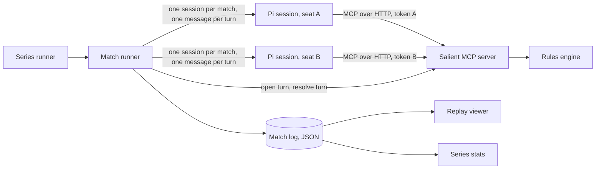

# Salient build brief

This brief tells a software factory or coding agent what to build for Salient v0, how the parts fit together, and how to run LLM players through the Pi coding agent. The rules themselves are in [salient-rules-v0.md](salient-rules-v0.md); this document does not repeat them.

Written 4 October 2026. Nothing is built yet apart from a throwaway prototype in [reference/](reference/README.md).

**Project and game.** No Dice is the over-arching project: a competition for LLMs played through games with no luck in them. Salient is its first game, and others may follow. Keep what is specific to Salient (engine, tools, board rendering) apart from what a later game would reuse (Pi harness, match and series runners, stats). Do not build a general game framework in v0.

## 1. What to build

Salient is a two-player, deterministic, turn-based territory game that LLMs play through MCP tools. It has two purposes: a spectacle people can watch, and a real test of which model plans, predicts and uses tools better.

v0 consists of seven parts:

| Part | One-line purpose |
| --- | --- |
| Rules engine | Pure functions: map generation, visibility, validation, resolution, scoring |
| MCP server | Exposes the seven player tools, enforces limits, holds match state |
| Player harness | Runs one LLM per seat through the Pi coding agent, as one continuous session per match |
| Match runner | Owns the turn loop for one match and writes the match log |
| Series runner | Runs seat-swapped matches for a pair of models until the result is clear, with resume |
| Baseline bots and stats | Random and Greedy opponents; a series report |
| Replay viewer | Renders any match log turn by turn, as in the [mock-ups](salient-mockups.md) |

### Done means

1. `no-dice match --game salient --a <model> --b <model> --seed <n>` plays a complete match between two models through Pi and writes one log file.
2. `no-dice series --game salient --a <model> --b <model>` runs seat-swapped pairs until the result is clear or a maximum is reached, can be stopped and resumed, and writes a series report.
3. The engine passes the golden replays, the symmetry test and the unit vectors in section 8.
4. The viewer loads a log file and replays it, matching the spectator mock-up.
5. Either seat can be filled by the Random or Greedy bot instead of a model.

## 2. Requirements that shape every decision

These come from the original design conversation and are not negotiable in v0.

- **No luck in play.** The only randomness is seeded map generation, and maps are symmetric.
- **Simultaneous turns.** Both players plan from the same state; neither sees the other's orders before resolution. A faster model gains nothing.
- **Tools only.** Players see and act through MCP tools. No vision, no other channel.
- **Continuous context.** Each player plays a whole match as one conversation. Building and adjusting a strategy over the game, and coping with a deep context, are part of what is tested.
- **The log is the match.** One JSON file fully describes a match. The viewer and the stats read only logs and contain no game logic.
- **Equal treatment.** Same prompt, same tools, same limits for both seats, and every map played twice with seats swapped.
- **Affordable to repeat.** A series can run to 100 matches or more. Because the conversation grows every turn, tool results must stay compact and prompt caching must be on.

## 3. Out of scope for v0

- Live streaming of a match in progress
- Video export of a replay
- More than two players, or leagues and ratings across many models
- A launching UI beyond the local console in `packages/ui` (`no-dice-ui`), which is loopback-only and one user on one machine: it starts a match or a series in its own process, lists finished results and resumes an interrupted series. Hosting, auth, sessions and HTTPS stay out, as does live per-turn streaming of a match in progress — the console's progress is per pair and per match.
- Own-orientation boards (an [open question](salient-rules-v0.md#Open%20questions))
- A calibrated win-probability bar (needs a large batch of real logs first)

## 4. Architecture



- **One process per match.** The match runner starts the MCP server in-process on a free localhost port, creates the match, and issues one bearer token per seat.
- **One Pi session per player per match.** The runner starts both at kick-off and sends each one a message per turn. This implements the "one conversation per match" rule.
- **The server is the referee.** Every limit is enforced on the server, never by trusting the harness or the model.
- **The runner owns time.** It opens a turn, prompts both players together, waits for both submissions or the timeout, asks the server to resolve, and logs.

## 5. Stack and repository layout

Assumed stack: **TypeScript on Node 22 or later**, because Pi and the official MCP SDK are both TypeScript. Change it if the factory has a strong reason.

- Package manager and workspace: pnpm
- Tests: vitest
- MCP server: `@modelcontextprotocol/sdk` with the Streamable HTTP transport
- Schemas: zod, shared between server and runner
- Viewer: a static web app with no backend (Vite; SVG or DOM for the board)

```
no-dice/
  packages/        shared by every game
    harness/       Pi player and bot player
    runner/        match runner, series runner, CLI
    stats/         series report, showcase selection
  games/
    salient/
      engine/      pure rules, no I/O, no clock, no randomness outside map generation
      server/      MCP server, match state, limits, admin calls for the runner
      bots/        Random and Greedy
      viewer/      replay renderer
      prompts/     player system prompt, turn prompt
      golden/      golden logs copied from this folder
  docs/            rules and this brief
```

## 6. Components

### 6.1 Rules engine

Implement exactly what [the rules](salient-rules-v0.md) say. The prototype in [reference/engine.js](reference/engine.js) is a working reference of about 160 lines; port its behaviour, not its style.

**Coordinates**

- Axial coordinates `(q, r)` with `|q| <= 5`, `|r| <= 5`, `|q + r| <= 5`: 91 hexes.
- Label: letter `A` + `(q + 5)`, number `r + 6`. So A6 is `(-5, 0)`, F6 is `(0, 0)`, the Bases are B6 `(-4, 0)` and J6 `(4, 0)`.
- Neighbours of `(q, r)`: `(q+1, r)`, `(q+1, r-1)`, `(q, r-1)`, `(q-1, r)`, `(q-1, r+1)`, `(q, r+1)`.
- Distance: `(|dq| + |dr| + |dq + dr|) / 2`.
- The half-turn rotation that makes maps fair is `(q, r) -> (-q, -r)`.

**Suggested API**

```ts
type Seat = "A" | "B";
type Terrain = "plain" | "node" | "base" | "blocked";
interface Hex { id: string; q: number; r: number; terrain: Terrain; owner: Seat | null; troops: number; garrison: number; }
interface Order { from: string; to: string; troops: number; }

generateMap(seed: number, config: Config): MatchState
visibleHexes(state: MatchState, seat: Seat): Set<string>
validateOrders(state: MatchState, seat: Seat, orders: Order[], apAvailable: number): { accepted: Order[]; wasted: { order: Order; reason: string }[] }
resolveTurn(state: MatchState, orders: Record<Seat, Order[]>, apSpentOnScouts: Record<Seat, number>, config: Config): { state: MatchState; events: Event[]; wasted: Record<Seat, Wasted[]> }
score(state: MatchState, seat: Seat, config: Config): { points: number; supplied: Set<string> }
```

**Determinism rules**

- Whole numbers only. No floating point anywhere in resolution or scoring.
- No clock, no `Math.random`, no dependence on object key order. Iterate hexes in one fixed order (row, then column).
- Map generation uses a small seeded generator. Port `genMap` and `mulberry32` from the prototype exactly if seeds should produce the same maps as the prototype. The golden logs carry their own maps, so this is optional.
- `resolveTurn` must not mutate its input, so `simulate` can call it safely.

**Details the prototype settles**

- An invalid order in a final submission still spends its action point.
- Troops available to move from a hex are the troops there at the start of the turn.
- Supply is a flood fill from the Base over the player's own hexes.
- Production happens after the knockout check, and only if the match continues.
- A knockout result is recorded as 93 to 0 (every point on the board). The last turn's board still shows the true position.

### 6.2 MCP server

One server, Streamable HTTP, bound to `127.0.0.1`. Each request carries `Authorization: Bearer <token>`; the token maps to one match and one seat. A player can never act for the other seat.

**Tool names.** Models see the server's own names: `get_state`, `submit_orders` and so on (§6.3, the seat's tools).

**Keep results compact.** Every tool result stays in the player's conversation for the rest of the match. Send static data once, in `get_rules`, and keep `get_state` to what changes.

**Limits the server enforces, per player per turn**

| Limit | Value | When exceeded |
| --- | --- | --- |
| Tool calls, not counting `submit_orders` | 12 | Error `tool_call_limit`; only `submit_orders` is still accepted |
| Simulations | 3 | Error `simulate_limit` |
| Action points | 6, shared by scouts and orders | Extra scouts are refused; extra orders are wasted |
| Submissions | One accepted, after at most one rejected | The second submission is always final |
| Notes length | 2,000 characters | Error `notes_too_long`, notes unchanged |

Every call counts towards the 12, including calls that return an error, except `submit_orders`. After a player's submission is accepted, every tool returns `already_submitted` until the next turn opens.

**Tools**

`get_rules` takes no input. It returns the player-facing rules as text, the constants, and the static map: every hex with its terrain and neighbours. Blocked hexes are listed without neighbours and never appear in another hex's list. A player needs to call it once, on turn 1.

```json
{
  "rules": "…",
  "constants": { "turns": 25, "action_points": 6, "start_troops": 5, "base_production": 2,
                 "node_production": 1, "node_garrison": 3, "home_bonus": 1,
                 "points": { "plain": 1, "base": 1, "node": 3 } },
  "bases": { "you": "B6", "enemy": "J6" },
  "map": [
    { "id": "B6", "terrain": "base", "neighbours": ["C6", "C5", "B5", "A6", "A7", "B7"] },
    { "id": "E6", "terrain": "blocked" }
  ]
}
```

`get_state` takes no input. It returns the turn, both scores, every hex the player knows this turn, and last turn's report. Owners are reported as `"you"`, `"enemy"` or `null`, never as A or B. Hexes are listed in one fixed order for both seats.

```json
{
  "turn": 7,
  "turns_total": 25,
  "scores": { "you": 21, "enemy": 19 },
  "action_points_left": 6,
  "limits": { "tool_calls_left": 11, "simulations_left": 3 },
  "hexes": [
    { "id": "C6", "owner": "you", "troops": 2, "neighbours": ["D6", "D5", "C5", "B6", "B7", "C7"] },
    { "id": "C5", "owner": "you", "troops": 0 },
    { "id": "D6", "owner": null, "troops": 0, "garrison": 3 },
    { "id": "E7", "owner": "enemy", "troops": 1 }
  ],
  "last_turn": {
    "your_orders": [{ "from": "B6", "to": "C6", "troops": 2 }],
    "wasted": [],
    "events": [{ "type": "capture", "at": "C6", "by": "you" }]
  }
}
```

- A hex is known if it is visible (owned, or next to an owned hex) or was scouted this turn. Unknown hexes are left out; their terrain is in the map from `get_rules`.
- `neighbours` is repeated only for hexes the player owns with troops on them, because those are the only hexes it can move from.
- `garrison` appears only on neutral Nodes.

`scout` takes `{ "hex": "H5" }`. It costs 1 action point and returns that hex and its neighbours in the same shape as `get_state` hexes, as they stood at the start of the turn. Those hexes count as known for the rest of the turn.

`simulate` takes `{ "orders": [...], "assumed_enemy_orders": [...] }`; the second field is optional. It runs the real resolution on the player's known hexes and returns the outcome without changing anything.

```json
{
  "accepted": [{ "from": "C6", "to": "D6", "troops": 4 }],
  "wasted": [{ "order": { "from": "C6", "to": "E6", "troops": 1 }, "reason": "destination is blocked" }],
  "changed_hexes": [{ "id": "D6", "owner": "you", "troops": 1 }],
  "your_score_after": 24
}
```

- Assumed enemy orders must start from known enemy hexes and are validated like real orders.
- Anything the player does not know is left out of the simulation; enemy troops arriving from unknown hexes cannot be modelled.
- Only the player's own projected score is returned, because the enemy's depends on hidden hexes.

`submit_orders` takes `{ "orders": [...], "intent": "...", "prediction": "..." }`. Intent and prediction are required, 1 to 280 characters each.

- If every order is valid, the submission is accepted and final.
- If any order is invalid on the first attempt, nothing is committed. The result lists each invalid order with its reason, and the player may submit once more.
- The second submission is final whatever it contains. Its invalid orders are wasted and still spend their action points.
- A call that fails schema validation is not a submission and returns an error.

`read_notes` takes no input and returns `{ "notes": "..." }`. Notes are stored on the server per match and seat.

`write_notes` takes `{ "notes": "..." }` and replaces the previous notes.

**Admin calls for the runner** (in-process functions, not MCP tools)

- `createMatch(seed, config) -> { matchId, tokens: { A, B } }`
- `openTurn(matchId)`: resets per-turn counters and starts accepting calls
- `status(matchId) -> { submitted: { A, B } }`
- `resolveTurn(matchId) -> { events, result? }`: a seat that has not submitted passes
- `turnRecord(matchId, turn)`: everything the server saw for the log, including each tool call with inputs, results and timings, and any rejected submission

### 6.3 Player harness: the Pi coding agent

Each player is one headless Pi session that lasts the whole match, with a locked-down configuration: the model can call the seven Salient tools and nothing else. The runner drives it in Pi's RPC mode, sending one prompt per turn.

The facts in this section were checked against the Pi documentation on 4 October 2026. Pi 1.0 was released on 1 October 2026 and added built-in MCP support, so treat the items under "Verify on first run" as required checks.

**Install and pin**

- Package: `@earendil-works/pi-coding-agent` (the project moved from `@mariozechner/pi-coding-agent`).
- Install: `npm install -g @earendil-works/pi-coding-agent`, or `curl -fsSL https://pi.dev/install.sh | sh`.
- Use Pi 1.0 or later. Pin the exact version, and record `pi --version` in every log header.

**Isolated configuration per seat**

Set `PI_CODING_AGENT_DIR` to a directory the runner creates for the match and seat. Pi then ignores the user's own `~/.pi/agent` settings, extensions, skills and context files. Run each process with its working directory set to an empty folder.

**The seat's tools**

The seat gets the seven tools from `packages/harness/src/seat-tools.ts`, a Pi extension loaded with `-e`. It connects to the match's server with `SALIENT_URL` and `SALIENT_TOKEN` from the environment, lists the server's tools, and registers each under the server's own name with its description and input schema; a call is forwarded as it is, and the server's answer comes back as the content it sent. Every game action is an ordinary tool call that the server and the log can count.

Pi's built-in MCP support is not used: it always names a server's tools `mcp__<server>__<tool>`, and models shorten or mangle that prefix often enough to waste calls.

`$PI_CODING_AGENT_DIR/settings.json`:

```json
{
  "defaultTools": [],
  "autoEnableCodemode": false,
  "extensions": ["-builtin:codemode", "-builtin:tool-search", "-builtin:llama.cpp"],
  "compaction": { "enabled": true },
  "quietStartup": true
}
```

**Starting a player, once per match**

```sh
cd "$RUN_DIR/cwd-A"
PI_CODING_AGENT_DIR="$RUN_DIR/pi-home-A" \
SALIENT_URL="http://127.0.0.1:8787/mcp" SALIENT_TOKEN="$TOKEN_A" \
PI_SKIP_VERSION_CHECK=1 PI_TELEMETRY=0 PI_CACHE_RETENTION=long \
pi --mode rpc \
   --session-dir "$RUN_DIR/session-A" \
   --no-builtin-tools \
   -e "$REPO/packages/harness/src/seat-tools.ts" \
   --no-context-files --no-skills --no-prompt-templates --no-themes \
   --system-prompt "$REPO/games/salient/prompts/player-system.md" \
   --model "<provider>/<model-id>" --thinking <level>
```

| Flag or variable | Why |
| --- | --- |
| `--mode rpc` | One long-lived process. The runner writes JSON commands to its stdin and reads responses and events from its stdout, one JSON object per line |
| `--session-dir` | Saves the full conversation to disk as the raw transcript of the match |
| `--no-builtin-tools` | Removes `read`, `bash`, `edit`, `write` and the rest. Without this a model could read the match log from disk |
| `-e <seat-tools.ts>` | Gives the seat the seven game tools under their own names |
| `--no-context-files`, `--no-skills`, `--no-prompt-templates`, `--no-themes` | No AGENTS.md, skills or templates leak into the prompt |
| `--system-prompt <path>` | Replaces Pi's coding-agent system prompt with the player prompt |
| `--model`, `--thinking` | The model under test and its reasoning level (`off`, `minimal`, `low`, `medium`, `high`, `xhigh`, `max`). `--provider` alone is an error in Pi 1.0; always give `--model` |
| `PI_CACHE_RETENTION=long` | Asks for extended provider prompt caching, which matters because the whole conversation is re-sent on every model call |

**One turn**

1. Write the prompt command to stdin:

   ```json
   {"id":"turn-7","type":"prompt","message":"Turn 7 of 25. Play your turn."}
   ```

2. Pi answers at once with `{"id":"turn-7","type":"response","command":"prompt","success":true,"data":{"disposition":"started"}}`. That only means the prompt was accepted.
3. Read events from stdout until `agent_settled`. That event means Pi will do nothing more for this prompt.
4. Ask for totals: `{"id":"stats-7","type":"get_session_stats"}`. The reply has `tokens` (`input`, `output`, `cacheRead`, `cacheWrite`, `total`), `cost`, and `contextUsage` (`tokens`, `contextWindow`, `percent`). Per-turn usage is the difference from the previous turn's totals.
5. To stop a turn that has run out of time, send `{"type":"abort"}`.

At the end of the match, close the process's stdin; Pi shuts down in an orderly way.

**Events the runner reads**

- `tool_execution_start` (`toolCallId`, `toolName`, `args`) and `tool_execution_end` (`result`, `isError`)
- `message_update` and `message_end`: `usage` and `cost` for each model call
- `agent_settled`: the turn is over
- `auto_retry_end` with `finalError`: the provider failed for good

**Context growth and compaction**

- The conversation holds every earlier turn: prompts, tool calls, tool results and the model's replies. A rough estimate, to be measured in build step 3, is 2,000 to 5,000 tokens added per turn, so 50,000 to 125,000 tokens by turn 25.
- Pi compacts automatically when the context passes the model's window minus 16,384 tokens. It keeps about the latest 20,000 tokens and replaces everything older with a summary written by the same model.
- Compaction stays on, so a model with a small window keeps playing on a summary instead of failing. This is an [open question](salient-rules-v0.md#Open%20questions) in the rules.
- Log every compaction and show it in the replay. Detect it from a drop in `contextUsage.tokens` between turns, and from Pi's own compaction event if one appears in the stream.
- Notes on the server are untouched by compaction.

**Model credentials.** With a relocated config directory, logins stored in `~/.pi/agent` are not available. Pass provider API keys as environment variables, or use `--api-key`. `pi auth check --provider <name> --json` confirms a credential resolves.

**Turn outcome**

| Situation | Outcome |
| --- | --- |
| `agent_settled` arrives and the server has an accepted submission | Normal turn |
| The server has an accepted submission but the agent is still running | Wait 10 seconds, then send `abort` |
| `agent_settled` arrives with no accepted submission | Pass, logged with reason `no_submission` |
| 5 minutes pass with no accepted submission | Send `abort`, pass, reason `timeout` |
| The `prompt` command is never answered and the Pi process is still running | Pass, reason `prompt_timeout` — not `timeout`, which is the turn cap above. The seat's own client gives up on the command; the seat is then sent `abort` and waited out, so the run Pi starts for that prompt late is logged on this turn rather than played into the next. Before the next turn asks again the seat is put back in order — asked whether it is still streaming or compacting (`get_state`), stopped if it is (`abort`), cleared of anything queued (`clear_queue`), each on a short budget and survivably — and it is never re-prompted. A seat that still will not take a prompt after that passes the turn with `prompt_timeout` as well — the harness has just measured that the seat was not quiet; the player stays in the match |
| Output tokens for the turn exceed the budget | Send `abort`, pass unless already submitted, reason `token_budget` |
| Provider error after Pi's retries | Pass, reason `provider_error`; the series runner may void and replay the match |
| The Pi process exits during the match | Void the match, reason `harness_crash` |
| A tool the seat was not given is called, by any name (`mcp__salient__submit_orders`, `mcpsalient_write_notes`, `bash`) | Not a void: Pi's lock-down answers that there is no such tool, the call is logged as refused, and the turn goes on. It never reaches the server, so it does not count toward the tool-call cap |

After a pass the player stays in the match and is prompted again next turn, with the failed turn still in its history. A voided match must be replayed from turn 1 on the same seed. Never retry a single turn, because the model would see the position twice.

**Verify on first run**

- [ ] The model's first request offers exactly the seven tools, by their own names.
- [ ] `--no-builtin-tools` together with the settings above leaves no `bash`, `read`, `codemode` or `tool_search` tool available. If any survives, add `--tools` with an explicit allowlist of the seven tool names.
- [ ] `--system-prompt` with a file path replaces the default prompt completely.
- [ ] The seat's connection to the server stays up for all 25 turns of one RPC session.
- [ ] `agent_settled` arrives once per prompt, and `get_session_stats` returns `contextUsage`.
- [ ] Turn 25's model request still contains turn 1's tool results when no compaction has happened.
- [ ] Which event, if any, RPC mode emits when compaction runs.
- [ ] Cache reads show up in `tokens.cacheRead` for every provider under test.

**Fallbacks if RPC mode or the CLI lock-down falls short**

- **SDK.** One `createAgentSession` from `@earendil-works/pi-coding-agent` per player per match, with the built-in tools switched off (an empty `tools` list, not `noTools`, which may also remove custom tools) and either the MCP server registered through `pi.registerMcpServer(...)` or the seven tools passed as `customTools` that call the server. Call `session.prompt(...)` once per turn and subscribe with `session.subscribe(...)` for the same events.
- **One process per turn on a saved session.** `pi --mode json --session-dir <dir> --session <id> "Turn 7 of 25. Play your turn."` reopens the same conversation each turn. It is simpler to supervise but reconnects MCP every turn.

**Prompts**

`games/salient/prompts/player-system.md` holds the full player-facing rules, taken from the rules file sections Board to Scoring, followed by these instructions:

```
You are one of the two players in a game of Salient. You act only through the salient tools.

The whole match is one conversation. Each turn you receive a message naming the turn. Everything from earlier turns stays in this conversation, so build a strategy and adjust it as the game goes.

On turn 1, call get_rules once. It gives the constants and the map: every hex, its terrain and its neighbours.

Each turn:
1. Call get_state.
2. Plan. You may scout (1 action point each) and simulate (up to 3 times).
3. Call submit_orders with your orders, your intent and your prediction of the enemy's move. If any order is invalid you are told why and may submit once more; that second submission is final.

You have 12 tool calls a turn, not counting submit_orders. If you never submit, you pass the turn.
You also have notes (read_notes, write_notes). Notes last for the whole match, even if the early conversation is summarised to save space.
The higher score after turn 25 wins. Capturing the enemy Base wins at once.
```

The per-turn message is only `Turn <n> of 25. Play your turn.` Both seats get byte-identical prompts.

### 6.4 Match runner

```
create match (seed, config) -> tokens
write pi-home, cwd and session folders for both seats
start player A and player B                 # one Pi session each, or a bot
for turn in 1..25:
    server.openTurn()
    prompt both players together
    wait until both have submitted and settled, or timeout
    abort any player still running
    record = server.turnRecord() + each player's usage, cost, context size, wall time
    result = server.resolveTurn()
    append record, events and the new board to the log
    if result is knockout: break
stop both players
write the log file atomically
```

A `Player` interface hides the difference between a model and a bot:

```ts
interface Player {
  start(ctx: { serverUrl: string; token: string }): Promise<void>;
  playTurn(turn: number): Promise<TurnOutcome>;
  stop(): Promise<void>;
}
```

- `PiPlayer` runs the RPC session in 6.3.
- `BotPlayer` calls the same MCP tools from a small client, so bots see exactly what models see.

### 6.5 Series runner

- **Pairs.** For each seed, play two matches: model X in seat A, then model X in seat B. A pair is never left half played.
- **Seeds.** A fixed, recorded list. New series for the same pairing reuse it.
- **Adaptive length.** Play in batches of 5 pairs. After each batch from 10 pairs on, compute the 99% Wilson interval for model X's win rate, counting a draw as half a win. Stop when that interval excludes 50%, or at `--max-pairs` (default 75, which is 150 matches).
- **Why 99%.** Checking after every batch makes a false early stop more likely, so the stopping test is stricter than the 95% interval in the final report. The report says whether the series stopped early.
- **Concurrency.** Run several matches at once, limited by provider rate limits. Each match already makes two model calls in parallel.
- **Resume.** A match whose log file exists is skipped. Logs are written atomically.
- **Cost guard.** `--max-cost` stops the series when the summed cost passes the limit.
- **Layout.** `series/<name>/matches/<seed>-<seat-map>.json`, `series/<name>/sessions/...` for Pi's saved conversations, `series/<name>/series.json` for the report.

### 6.6 Baseline bots

- **Random.** Up to 6 random legal moves per turn, from a seeded generator so matches are repeatable.
- **Greedy.** Port the `expander` style from [reference/bots.js](reference/bots.js): take Nodes it can afford, claim open hexes, attack where it has enough troops, march interior troops to the front.

Bots must never scout or peek at hidden state. They receive the `get_rules` and `get_state` JSON and nothing else.

### 6.7 Series stats

For each pairing, report:

- Wins, losses and draws; win rate with a 95% Wilson interval; whether the series stopped early
- Mean margin with a bootstrap interval; knockouts count as 93
- Knockout count and the turns they happened
- Per model: passes by reason, wasted orders, rejected submissions, tool errors, scouts and simulations per turn, tokens and cost per turn
- **Decline with depth.** The same error counts split into turns 1 to 8, 9 to 17 and 18 to 25, with context size by turn and the turns at which compaction happened. This is where a weakness in handling a long conversation shows.
- Seat effect: results split by seat, to confirm the swap cancels it

**Showcase selection.** To pick the match to render:

1. Keep matches won by the series winner whose margin is within the middle half of that winner's margins.
2. Rank them by an excitement score: lead changes, plus the largest single-turn swing, plus how late the final lead change came.
3. Show the series result on screen next to the chosen match.

### 6.8 Replay viewer

Build what [the mock-ups](salient-mockups.md) show. Requirements:

- Load a match log from a file picker, drag and drop, or a `?log=` URL.
- Step, scrub and autoplay through turns. Each turn animates in order: orders appear as arrows, clashes and fights flash, the board settles to the logged state.
- Spectator view by default; a toggle shows either player's fog-of-war view.
- Header: model names, both scores, the score bar, turn counter, series line.
- Side panels: each player's intent, prediction, tool-call trace for the turn, troops, Nodes held, actions used.
- Mark a turn where a player's first submission was rejected, a turn it passed, and a turn where its context was compacted. A context-size meter per player is a useful addition to the side panels.
- Lead-by-turn chart with the current turn marked.
- A one-line headline for the turn, generated from the events.
- Read everything from the log. The viewer never imports the engine.

## 7. Data formats

### Orders

```json
{ "from": "C6", "to": "D6", "troops": 4 }
```

### Match log, format 1

```json
{
  "format": "salient-log/1",
  "ruleset": "v0",
  "engine_version": "0.1.0",
  "created": "2026-10-04T22:00:00Z",
  "seed": 135,
  "config": { "turns": 25, "action_points": 6, "start_troops": 5, "base_production": 2,
              "node_production": 1, "node_garrison": 3, "home_bonus": 1,
              "points": { "plain": 1, "base": 1, "node": 3 } },
  "harness": { "pi_version": "1.0.x", "context": "continuous", "compaction": true,
               "tool_call_cap": 12, "simulate_cap": 3, "resubmissions": 1,
               "turn_timeout_s": 300, "output_token_budget": null },
  "players": {
    "A": { "kind": "pi", "model": "<provider>/<model-id>", "thinking": "medium", "context_window": 0 },
    "B": { "kind": "bot", "bot": "greedy" }
  },
  "map": [{ "id": "F1", "q": 0, "r": -5, "terrain": "plain" }],
  "bases": { "A": "B6", "B": "J6" },
  "start": { "cells": [[0, 0, 0, 0]], "score": { "A": 1, "B": 1 } },
  "turns": [
    {
      "n": 1,
      "players": {
        "A": {
          "tool_calls": [{ "tool": "get_state", "args": {}, "result": {}, "error": false, "ms": 0 }],
          "scouts": [],
          "rejected_submission": null,
          "orders": [{ "from": "B6", "to": "C6", "troops": 2 }],
          "wasted": [],
          "intent": "…",
          "prediction": "…",
          "passed": null,
          "notes_after": "…",
          "usage": { "input": 0, "output": 0, "cache_read": 0, "cache_write": 0 },
          "cost_usd": 0,
          "context_tokens": 0,
          "compacted": false,
          "wall_ms": 0
        },
        "B": {}
      },
      "events": [{ "type": "capture", "at": "C6", "by": "A", "from": null, "terrain": "plain" }],
      "after": { "cells": [[0, 0, 0, 0]], "score": { "A": 3, "B": 3 }, "troops": { "A": 7, "B": 7 } }
    }
  ],
  "result": { "type": "time", "winner": "A", "turn": 25, "score": { "A": 49, "B": 41 }, "margin": 8 }
}
```

- `cells[i]` describes `map[i]`: `[owner, troops, garrison, cut_off]`, with owner `0` neutral, `1` A, `2` B, and `cut_off` `1` for an owned hex that is out of supply.
- Event types: `clash` (`between`, `A`, `B`), `battle` (`at`, `A`, `B`, `owner`), `repelled` (`at`, `by`, `n`), `capture` (`at`, `by`, `from`, `terrain`).
- `rejected_submission` is `null`, or the orders of the first attempt with the reason each invalid one was refused.
- `passed` is `null` or one of the reasons in 6.3.
- `context_tokens` is the size of the player's conversation after the turn.
- `result.type` is `time` or `knockout`; `winner` is `null` for a draw.

### Golden logs

The five files in `golden/` (listed in [reference/README.md](reference/README.md)) come from the prototype and use a simpler shape: no `format` field, `orders` as `[from, to, troops]` triples, terrain under `t`, and no per-player tool data. [reference/replay-check.js](reference/replay-check.js) shows how to replay them.

## 8. Tests and acceptance

**Engine**

- [ ] **Golden replays.** Loading each golden log's map and start position, then applying its orders turn by turn, reproduces every logged board, score and result.
- [ ] **Combat vectors.** The five rows of the combat table in the rules.
- [ ] **Symmetry.** Two copies of the Greedy bot, each given the board rotated so its Base is on the left, draw with equal scores on every one of 300 seeds.
- [ ] **Determinism.** The same seed and orders give byte-identical logs on repeated runs.
- [ ] **Invalid orders.** Unknown hex, source not owned, blocked or non-adjacent destination, zero or fractional troops, more troops than present, more orders than action points. In a final submission each is wasted with a reason and spends its action point.
- [ ] **Supply.** A region cut from its Base scores nothing and scores again once reconnected.
- [ ] **Knockout.** Recorded as 93 to 0; both Bases falling on one turn is a draw.

**Server**

- [ ] **No leaks.** `get_state`, `scout` and `simulate` never reveal the owner, troops or garrison of a hex the player does not know. Test with a hidden enemy stack next to the visible area.
- [ ] **Seat isolation.** A token for seat A cannot read or change anything belonging to seat B.
- [ ] **Limits.** Each limit in 6.2 returns its error and changes nothing.
- [ ] **Resubmission.** A first submission with an invalid order is rejected with reasons and commits nothing. The second is final and wastes its invalid orders. A valid first submission cannot be replaced.
- [ ] **Scout timing.** A scout shows the start-of-turn state, even if the opponent has already submitted.

**Harness**

- [ ] The "Verify on first run" list in 6.3.
- [ ] Bot versus bot through real MCP calls gives the same log as bot versus bot in-process.
- [ ] A model that never submits passes after the timeout, stays in the match, and is prompted on the next turn.
- [ ] A Pi process killed mid-match voids the match.
- [ ] Measure tokens, cost and context size by turn for one full model-versus-Greedy match before running any series.

**Series**

- [ ] **Adaptive stop.** With scripted results, 18 wins in the first 20 matches stops the series at 10 pairs, and alternating wins run it to the maximum.
- [ ] **Resume.** Stopping and restarting a series replays nothing that already has a log.

**Viewer**

- [ ] Golden log 01 at turn 11 matches the spectator mock-up: scores 43 and 33, five cut-off hexes, the fight at F6.

## 9. Build order

| Step | Deliverable | Proves |
| --- | --- | --- |
| 1 | Engine with golden, symmetry and vector tests | The rules are implemented exactly |
| 2 | MCP server and both bots playing through it | The tool surface and limits work without any model |
| 3 | Pi harness: one model against Greedy for one match | The lock-down works, and the cost and context growth per match are known |
| 4 | Series runner and stats | A pairing can be measured |
| 5 | Viewer | A match can be watched |
| 6 | First real series, then a rules review | Whether the open questions need action |

Steps 4 and 5 are independent and can be built in parallel once step 2 fixes the log format.

## 10. Risks and open items

- **Pi 1.0 is days old.** Its MCP support, RPC behaviour and lock-down flags are the least certain part of this brief. Step 3 exists to find out early, and the SDK fallback avoids the CLI entirely.
- **Cost grows through a match.** The whole conversation is re-sent on every model call, and a turn has several calls. Total input tokens rise roughly with the square of the number of turns. Prompt caching softens this; step 3 must measure it before any series is run.
- **Context windows.** The estimate in 6.3 fits a 200,000-token window. A smaller window will compact, possibly more than once. Compaction changes what a model remembers, so its effect on results has to be watched.
- **Token budget is unset.** `[Token budget to be set per model family]` in the rules needs a number once step 3 has measured real turns.
- **Prediction scoring.** Intent and prediction are free text. Scoring a prediction as right or wrong needs either a structured field or a judge; undecided.
- **Provider rate limits** bound how many matches can run at once.
- The rules' own [open questions](salient-rules-v0.md#Open%20questions) stay open until real matches exist.

## 11. What the builder needs from Jim

- [ ] Which models and providers to test first, with their exact model IDs
- [ ] API keys for those providers, supplied as environment variables
- [ ] A cost ceiling for the first series
- [ ] The per-turn output-token budget, after step 3
- [ ] Whether compaction stays on, after seeing how often it happens
- [ ] Where the repository lives

## 12. Sources for the Pi facts

- [Pi home page](https://pi.dev/)
- [CLI reference](https://pi.dev/docs/latest/cli)
- [MCP](https://pi.dev/docs/latest/mcp)
- [Codemode](https://pi.dev/docs/latest/codemode)
- [Settings](https://pi.dev/docs/latest/settings)
- [Environment variables](https://pi.dev/docs/latest/environment-variables)
- [RPC mode](https://pi.dev/docs/latest/rpc)
- [RPC commands](https://pi.dev/docs/latest/rpc-commands)
- [Sessions](https://pi.dev/docs/latest/sessions)
- [Compaction](https://pi.dev/docs/latest/compaction)
- [JSON mode](https://pi.dev/docs/latest/json)
- [Driving Pi from another program](https://pi.dev/docs/latest/cli-integration)
- [SDK](https://pi.dev/docs/latest/sdk)
- [Pi 1.0.0 changelog](https://pi.dev/changelog/releases/1.0.0)
- [Pi 1.0 release guide, Developers Digest](https://www.developersdigest.tech/blog/pi-1-0-release-guide-mcp-codemode-pi-durable)
