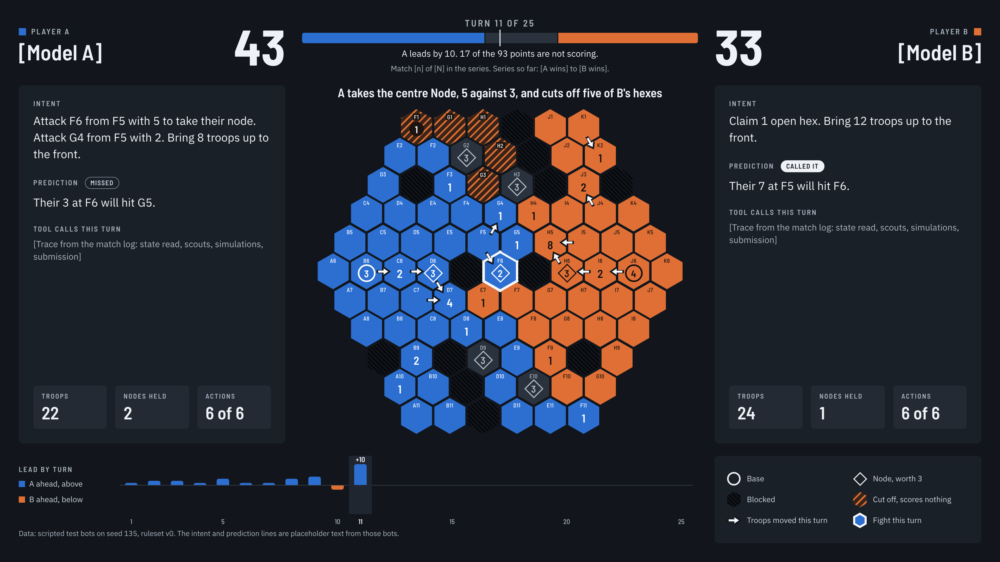
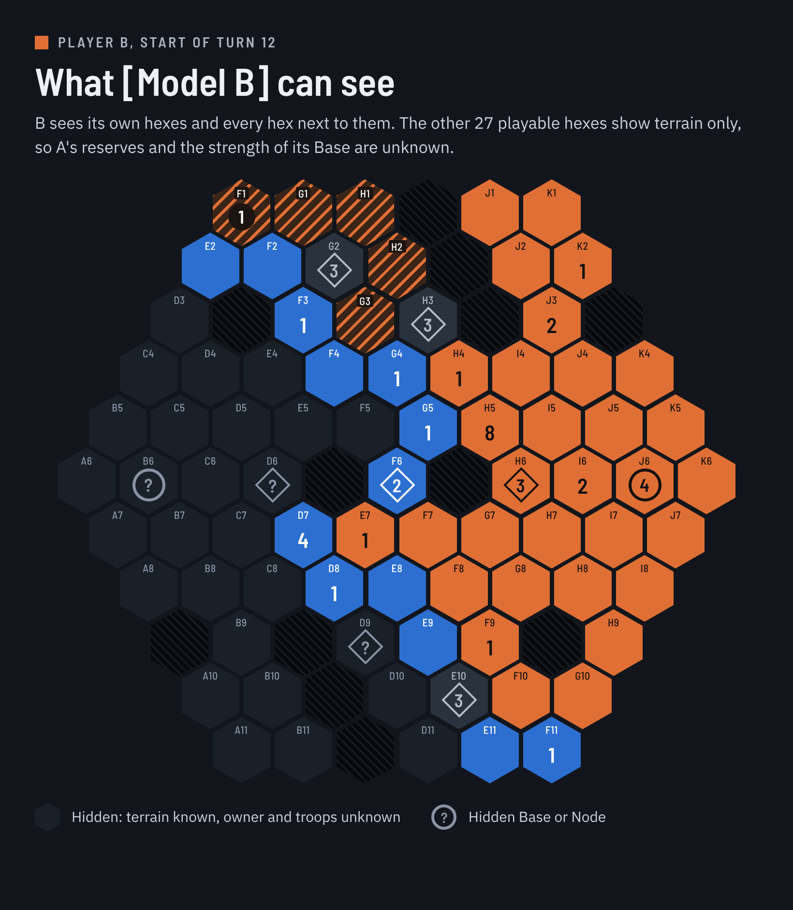

# Salient mock-ups

Two frames show what the replay viewer should look like. Both are drawn from real data: turn 11 of [golden/golden-01-time-win.json](golden/golden-01-time-win.json), a test match between two scripted bots.

Related: [build brief](salient-build-brief.md) · [rules](salient-rules-v0.md) · [folder guide](README.md)

## Spectator view

The spectator sees the whole board, both players' stated plans, and who is ahead.

| Element | What it shows | Log field |
| --- | --- | --- |
| Big numbers, top left and right | Each player's score | `turns[n].after.score` |
| Score bar | A's points from the left, B's from the right, points nobody is scoring in the middle. The tick marks half of the 93 points | `after.score`, total from `map` and `config.points` |
| Line under the bar | Lead, and the series result so far | `after.score`; series report |
| Headline above the board | The turn's main events in one sentence | Generated from `turns[n].events` |
| Board | Owner colour, troop count and label for every hex | `map`, `after.cells` |
| White arrows | Troops moved this turn | `turns[n].players.*.orders` |
| White outline around a hex | A fight happened there this turn | `events` of type `battle` or `clash` |
| Hatched hexes | Owned but cut off from the Base, so scoring nothing | `after.cells[i][3]` |
| Side panels | Intent, prediction, tool calls, troops, Nodes held, actions used | `turns[n].players.*` |
| Lead by turn | Points margin after each turn so far; A above the line, B below | `after.score` for turns 1 to n |
| Key | The six board symbols | Static |

## Player view under fog of war

The same position as Player B knows it at the start of turn 12. This is what `get_state` describes to the model, and the viewer should offer it as a toggle.

- B sees its own hexes and every hex next to them.
- The other 27 playable hexes show terrain only. A question mark stands for a troop count B cannot know.
- Base and Node positions are always visible, because terrain is never hidden.

## Board symbols

| Symbol | Meaning |
| --- | --- |
| Number | Troops on the hex. No number means none |
| Number in a circle | Base |
| Number in a diamond | Node, worth 3 points. Grey means neutral, and the number is its garrison |
| Dark hatched hex | Blocked, impassable |
| Team-coloured hatched hex | Owned but cut off from the Base |
| Small code at the top of a hex | Its label, as used in orders and intent text |

## Build notes

- **Frame.** 1920 × 1080, so a replay can be recorded as 16:9 video without re-layout.
- **Hex geometry.** Pointy-top hexes of size 37 px. Centre of hex `(q, r)` is at `x = 64.09 × (q + r / 2)`, `y = 55.5 × r` from the board centre. Each hex is drawn 60 × 69 px, which leaves a 4 px gap.
- **Colours.** Player A `#2c6fd1` with white text; Player B `#e06f35` with `#14110f` text; neutral `#2a323d`; background `#12161c`; panels `#1a2028`; text `#eef1f5` and `#aab3bf`. The blue and orange pair was checked for colour-blind separation.
- **Type.** Barlow Semi Condensed for numbers and labels, IBM Plex Sans for sentences.
- **Markup.** The standalone HTML files hold the exact CSS for hexes, arrows and symbols and can be used as a starting point.

## What is placeholder

- `[Model A]`, `[Model B]` and the series line stand for real names and results.
- The tool-call trace is a bracketed placeholder; the scripted bots make no tool calls.
- The intent and prediction sentences are template text from the scripted bots.
- The "Called it" and "Missed" tags were judged by hand for this frame. How predictions are scored is undecided.

## Files

| File | What |
| --- | --- |
| [mockups/spectator-view.png](mockups/spectator-view.png) | Spectator frame, rendered at 2× |
| [mockups/fog-of-war-view.png](mockups/fog-of-war-view.png) | Fog-of-war frame, rendered at 2× |
| [mockups/spectator-view.html](mockups/spectator-view.html) | Standalone HTML and CSS for the spectator frame |
| [mockups/fog-of-war-view.html](mockups/fog-of-war-view.html) | Standalone HTML and CSS for the fog-of-war frame |

The editable originals are on a design canvas in Jim's Claude account: [Salient board mock-up](https://claude.ai/artifact/7tdTgiQn1gvozzkpBCUWs8).
