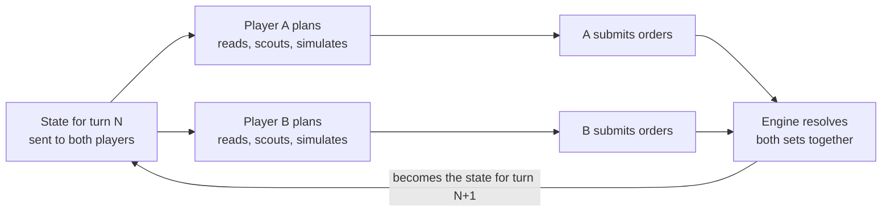

# Salient rules v0

Salient is a two-player territory game on a hex board, played entirely through MCP tool calls. Both players submit orders for the same turn in private, and the engine resolves them together with no dice.

It tests planning over a fixed horizon, prediction of an opponent, disciplined tool use and memory across turns.

Salient is the first game in the No Dice project. A salient is a bulge in a front line that can be cut off from behind, which is what the supply rule rewards.

Related: [build brief](salient-build-brief.md) · [mock-ups](salient-mockups.md) · [folder guide](README.md)

## Constants

| Constant | v0 value |
| --- | --- |
| Board | 91 hexes: 79 playable, 12 blocked |
| Match length | 25 turns |
| Action points per turn | 6 |
| Starting troops | 5, on the Base |
| Production per turn | Base +2, each Node +1 |
| Nodes | 7: three per side and one in the centre, each with a neutral garrison of 3 |
| Home bonus | +1 defence on any hex you own |
| Points | Plain hex 1, Base 1, Node 3; 93 on the board |

These values were tested in a prototype engine with scripted bots. The results are under [Baseline bots and series reporting](#Baseline%20bots%20and%20series%20reporting).

## Board and map

The board is a hexagon of 91 hexes, and every map is identical for both players under a half-turn rotation.

- **Labels.** Each hex has a letter (A to K) for its diagonal column and a number (1 to 11) for its row. The centre is F6.
- **Bases.** Player A starts at B6 and Player B at J6, eight hexes apart.
- **Blocked hexes.** 12 hexes are impassable. They create chokepoints.
- **Nodes.** Each side has one Node two hexes from its Base and two more between three and five hexes out. The seventh Node is F6.
- **Generation.** A seed picks the blocked hexes and Nodes for one half, and the engine rotates them onto the other half. It rejects any map whose playable hexes are not all connected.

The same seed always gives the same map, so a match can be re-run or replayed exactly.

## Turn structure

Both players plan from the same state at the same time, and neither sees the other's orders until the turn resolves.

1. The engine publishes the state for turn N. Each player receives only the part its visibility allows.
2. Each player plans privately: it reads the state, scouts, simulates and updates its notes.
3. Each player submits one final order set, with a stated intent and a prediction of the opponent's move.
4. Once both have submitted or timed out, the engine resolves the two order sets together.
5. The engine publishes the state for turn N+1.

A slow player delays the resolution and gains nothing from it. The two players' model calls can run in parallel.

## Orders and action points

Each player has 6 action points per turn, and unused points are lost.

| Action | Cost | Effect |
| --- | --- | --- |
| Move | 1 | Send N troops from a hex you own to an adjacent playable hex |
| Scout | 1 | Reveal one hex and its six neighbours, anywhere on the board |

- **Splitting.** Several moves may leave one hex, as long as they total no more than the troops there at the start of the turn.
- **One step.** Troops move one hex per turn. Troops that arrive this turn cannot move again until the next.
- **Emptying a hex.** A hex stays yours when its last troop leaves.
- **Invalid orders.** If a submission contains an order that breaks a rule, it is rejected with the reasons and the player may submit once more. In that final submission an invalid order is dropped, still costs its action point, and is logged as wasted.

Simulating, and reading or writing notes, cost no action points.

## Resolution

The engine applies both order sets in one fixed sequence, using whole numbers only.

1. **Validate.** Drop invalid orders and any beyond the action-point limit.
2. **Depart.** Remove moving troops from their source hexes.
3. **Clash on the edge.** If the players move across the same edge in opposite directions, the smaller force is destroyed and the larger loses the same number.
4. **Arrive.** Add the surviving troops to their destination hexes.
5. **Fight in the hex.** Where both players have troops, or one enters a hex the other owns, apply the combat rule below.
6. **Take neutral Nodes.** A force entering a neutral Node must exceed its garrison, and loses that many troops. A smaller force is destroyed and wears the garrison down by its own size.
7. **Set ownership.** A hex with surviving troops belongs to their player. A hex with none keeps its owner.
8. **Check for knockout.** A captured Base ends the match.
9. **Produce.** Each Base gains 2 troops and each owned Node gains 1.

**Combat rule.** The owner of the hex adds the home bonus of 1 to its strength. The larger strength wins and loses troops equal to the smaller strength, and the home bonus absorbs the owner's first loss. On a tie the attackers are destroyed and the hex does not change hands.

| Attackers | Defenders in a hex they own | Result |
| --- | --- | --- |
| 1 | 0 | Attack fails, hex holds |
| 2 | 0 | Captured, 1 attacker left |
| 4 | 3 | Attack fails, no defenders left, hex holds |
| 5 | 3 | Captured, 1 attacker left |
| 3 | 5 | Attack fails, 3 defenders left |

If both players enter the same neutral hex, they fight each other first with no bonus, and the survivor then faces any garrison.

## Visibility and scouting

A player sees its own hexes and every hex next to them, and the rest of the board is hidden.

- **Always known.** The terrain of every hex (blocked, plain, Node or Base) and both players' scores. Base locations are therefore never hidden; only their troop counts are.
- **Visible hexes.** Owner, troop count and garrison.
- **Hidden hexes.** Terrain only. The engine does not report what was last seen there.
- **Scouting.** One action point reveals a chosen hex and its six neighbours as they stood at the start of the turn. The result comes back at once, before orders are submitted.
- **Turn report.** After each resolution a player is told about the fights and captures on hexes it could see.

Remembering what it saw earlier is the player's job. That information is in its own conversation history and in whatever it chose to put in its notes.

## Scoring and match end

The match ends after turn 25 or when a Base falls, and the higher score wins.

- **Points.** A plain hex or a Base is worth 1 and a Node is worth 3.
- **Supply.** Only hexes connected to your Base through a chain of your own hexes score. A region cut off from the Base scores nothing until it is reconnected, though its Nodes still produce troops.
- **Knockout.** Capturing the enemy Base ends the match at once. It is recorded as 93 to 0 whatever the score at that moment, and the turn is logged. A strike at the Base is therefore a real alternative to taking hexes.
- **Margin.** The result records the winner and the points difference. The margin is the main input to series statistics.
- **Draws.** Equal scores are a draw. So is a turn on which both Bases fall.

## MCP tool surface

Seven tools cover everything a player can do, and there is no other way to see or change the game.

| Tool | Input | Returns | Limit |
| --- | --- | --- | --- |
| `get_rules` | none | Rules text, all constants and the map: every hex's terrain and neighbours | Free |
| `get_state` | none | Turn number, both scores, every known hex, the neighbours of hexes the player can move from, action points left, last turn's report | Free |
| `scout` | A hex | That hex and its six neighbours | 1 action point |
| `simulate` | Orders, plus optional assumed enemy orders | The resulting visible state and any validation errors | 3 calls per turn |
| `submit_orders` | Orders, intent, prediction | Which orders were accepted and which were wasted | Final once accepted; one resubmission if any order is invalid |
| `read_notes` | none | The player's saved notes | Free |
| `write_notes` | Text | Confirmation | 2,000 characters, replaces the previous notes |

- **Neighbours are listed.** `get_rules` gives every hex's neighbours once, and `get_state` repeats them for the hexes a player can move from, so the test is strategy and not hex arithmetic.
- **Notes are optional.** They last for the whole match and survive any summarising of the early conversation.
- **Simulation is blind.** `simulate` uses only what the player can see plus its own assumption about the enemy.
- **Intent and prediction are required.** Each is up to 280 characters: the plan, and the enemy move the player expects. They drive the replay commentary.

"Free" means no action points. Every call except `submit_orders` counts towards the per-turn tool-call cap below. The exact schemas are in the [build brief](salient-build-brief.md#6.2%20MCP%20server).

## Harness and fairness

Every model plays under the same prompt, tools and limits, and every map is played twice with the seats swapped.

- **Seat swap is required.** Two identical scripted bots split 25% to 69% by seat on symmetric maps. The only cause was the order in which they considered moves. A model's ordering habits could do the same.
- **One conversation per match.** Each player plays the whole match in a single continuous conversation and receives one message per turn. It can build a strategy and adapt it as the game goes, and any weakness in handling a long context shows in its play.
- **Context limits.** If a conversation nears a model's context window, the harness summarises the oldest part and carries on. Every such compaction is logged and shown in the replay.
- **Per-turn caps.** 12 tool calls a turn, not counting `submit_orders`, at most 3 of them simulations, and a fixed output-token budget. [Token budget to be set per model family.]
- **Timeout.** A turn with no submission after 5 minutes counts as a pass. The limit exists to catch failures and gives no reward for speed.
- **Tool errors.** A malformed tool call returns an error and uses one of the 12 calls.
- **Symmetry test.** Two copies of the same deterministic bot, each given the board in its own orientation, must draw every match with equal scores. The prototype engine passes this on 300 maps.

## Match log

One JSON file per match holds everything needed to replay it, and the renderer reads nothing else.

| Part | Contents |
| --- | --- |
| Header | Ruleset version, engine version, seed, map, both model IDs, seat assignment, harness limits |
| Each turn, per player | Every tool call in order with its inputs and results, any rejected submission, final orders, intent, prediction, wasted orders, tokens, cost, time, context size, any compaction |
| Each turn, shared | Resolution events (clashes, fights, captures), the full board after resolution, both scores |
| Result | Winner, end type (time or knockout), end turn, final scores, margin |

The log stores the full board every turn, so the renderer needs no game logic. Re-running the engine on the logged orders must reproduce the logged boards exactly, which guards against engine changes.

A 25-turn scripted test match came to about 49 KB before tool-call transcripts.

## Baseline bots and series reporting

Two scripted bots anchor the scale, and a series reports the margin as well as the wins.

| Bot | Behaviour | Purpose |
| --- | --- | --- |
| Random | Up to 6 random legal moves a turn | Floor: any working model should beat it almost every time |
| Greedy | Takes Nodes, claims open hexes, attacks where it has enough troops | Bar: a model that cannot beat it is not yet showing strategy |

**What the prototype showed.** Each pairing ran on 300 seeded maps, with scripted bots only.

- Greedy beat Random in every match, by 65 to 69 points on average.
- Two Greedy variants with different priorities split 88% to 11%, with an average margin of 9.5 points.
- First contact came around turn 6, and about 90% of the points were claimed by turn 13.
- No Greedy bot knocked out another. Knockouts happened only against Random, in 14% to 21% of matches.

These runs check that the rules work and the numbers are sane. They say nothing yet about strategic depth. The margins above were measured before knockouts were re-scored as 93 to 0.

**Series report.** For each pair of models:

- Win rate with a confidence interval, and mean margin
- Knockouts
- Wasted orders, rejected submissions and failed tool calls per model
- The same error counts split into early, middle and late turns, to show any decline as the conversation grows
- Context size by turn, and compactions
- Scouts and simulations used per turn
- Prediction accuracy [scoring method to be decided]

**Series length.** A series runs in batches. It stops early once the winner is clear and keeps going while the pairing is close, up to a fixed maximum. About 100 matches separate a 60/40 pairing on wins alone; a lopsided pairing needs far fewer.

## Open questions

These rules are the most likely to change after the first real matches.

- [ ] **Home bonus.** Without it, bot matches flipped about 6.5 hexes a turn late on and the lead changed 3.2 times a match, mostly from single troops trading empty hexes. With it, 1 to 2.4 hexes flip and the lead changes 1.4 times. Is +1 the right size?
- [ ] **Final-turn lunge.** A fixed last turn rewards all-in attacks that have no follow-up cost. Scoring the average of the last few turns would remove that.
- [ ] **Centre Node ping-pong.** In some bot matches the centre Node changed hands on alternate turns, because the bots attack with the exact minimum. Watch whether models do the same.
- [ ] **No last-seen memory.** The engine does not report what a player saw on earlier turns. The player has to find it in its own history or notes. Should `get_state` show last-seen values instead?
- [ ] **Compaction.** Summarising the oldest context keeps a small-window model in the game, but changes what it remembers. The alternative is to let it fail when it runs out of room.
- [ ] **Cost growth.** Each turn re-sends the whole conversation, so input tokens grow through the match. Measure a full match before the first series.
- [ ] **Own-orientation boards.** Showing each player the board with its own Base on the same side would remove seat bias at the source. The renderer would then have to translate hex labels in intent text.
- [ ] **Guessing check.** If the Greedy bot beats a strong model often, simultaneous turns are too much of a guessing game and the rules need more depth.

## Decided

All decided on 4 October 2026.

- **Knockouts end the match** and are recorded as 93 to 0 with the turn logged.
- **One continuous conversation per match**, not a fresh context each turn. Weaknesses that come from deep context are meant to show, and a model should be able to build and adjust a strategy through the game.
- **One resubmission** when a submission contains an invalid order, so a slip does not decide a turn.
- **Adaptive series length**: stop early when the result is clear, play more when it is close.
